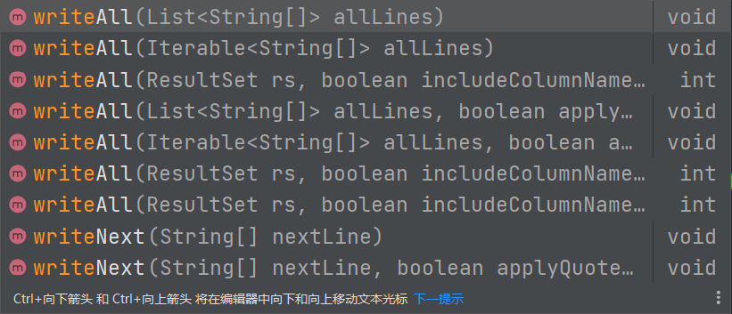
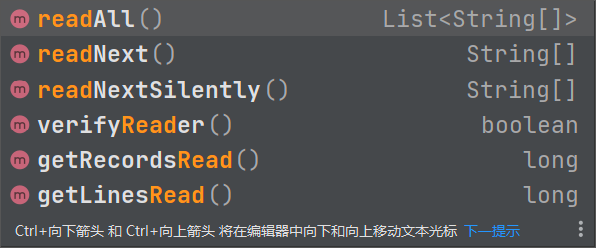
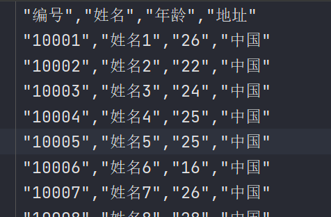
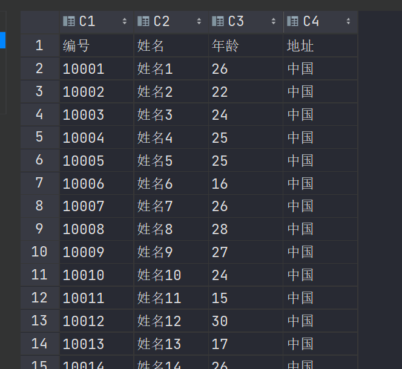

# csv文件

## 概述

CSV文件：Comma-Separated Values，中文叫逗号分隔值或者字符分割值，其文件以纯文本的形式存储表格数据。该文件是一个字符序列，可以由任意数目的记录组成，记录间以某种换行符分割。每条记录由字段组成，字段间的分隔符是其他字符或者字符串。所有的记录都有完全相同的字段序列，相当于一个结构化表的纯文本形式。用文本文件、excel或者类似与文本文件的编辑器都可以打开CSV文件。


## opencsv

我们可以使用opencsv类库来导出csv文件


依赖如下：

```xml
        <!--opencsv 依赖-->
        <dependency>
            <groupId>com.opencsv</groupId>
            <artifactId>opencsv</artifactId>
            <version>5.7.1</version>
        </dependency>
```


## API

写入到csv文件会用到CSVWriter对象，创建此对象常见API如下

```java
 /**
    * Constructs CSVWriter using a comma for the separator.
    *
    * @param writer The writer to an underlying CSV source.
    */
   public CSVWriter(Writer writer) {
      this(writer, DEFAULT_SEPARATOR, DEFAULT_QUOTE_CHARACTER, DEFAULT_ESCAPE_CHARACTER, DEFAULT_LINE_END);
   }

   /**
    * Constructs CSVWriter with supplied separator, quote char, escape char and line ending.
    *
    * @param writer     The writer to an underlying CSV source.
    * @param separator  The delimiter to use for separating entries
    * @param quotechar  The character to use for quoted elements
    * @param escapechar The character to use for escaping quotechars or escapechars
    * @param lineEnd    The line feed terminator to use
    */
   public CSVWriter(Writer writer, char separator, char quotechar, char escapechar, String lineEnd) {
      super(writer, lineEnd);
      this.escapechar = escapechar;
      this.quotechar = quotechar;
      this.separator = separator;
   }
```


* writer：CSV source
* separator：用于分隔条目的分隔符
* quotechar：用于带引号元素的字符
* escapechar：用于转义引号或转义字符的字符
* lineEnd：要使用的换行终止符


使用CSVWriter对象写入数据常用的方法如下：




读取csv文件会用到CSVReader对象，创建此对象常见API如下：

```java
/**
 * Constructs CSVReader using defaults for all parameters.
 *
 * @param reader The reader to an underlying CSV source.
 */
public CSVReader(Reader reader) {
    this(reader, DEFAULT_SKIP_LINES,
            new CSVParser(ICSVParser.DEFAULT_SEPARATOR,
                    ICSVParser.DEFAULT_QUOTE_CHARACTER,
                    ICSVParser.DEFAULT_ESCAPE_CHARACTER,
                    ICSVParser.DEFAULT_STRICT_QUOTES,
                    ICSVParser.DEFAULT_IGNORE_LEADING_WHITESPACE,
                    ICSVParser.DEFAULT_IGNORE_QUOTATIONS,
                    ICSVParser.DEFAULT_NULL_FIELD_INDICATOR,
                    Locale.getDefault()),
            DEFAULT_KEEP_CR,
            DEFAULT_VERIFY_READER,
            DEFAULT_MULTILINE_LIMIT,
            Locale.getDefault(),
            new LineValidatorAggregator(),
            new RowValidatorAggregator(),
            null);
}

/**
 * Constructs CSVReader with supplied CSVParser.
 * <p>This constructor sets all necessary parameters for CSVReader, and
 * intentionally has package access so only the builder can use it.</p>
 *
 * @param reader                  The reader to an underlying CSV source
 * @param line                    The number of lines to skip before reading
 * @param icsvParser              The parser to use to parse input
 * @param keepCR                  True to keep carriage returns in data read, false otherwise
 * @param verifyReader            True to verify reader before each read, false otherwise
 * @param multilineLimit          Allow the user to define the limit to the number of lines in a multiline record. Less than one means no limit.
 * @param errorLocale             Set the locale for error messages. If null, the default locale is used.
 * @param lineValidatorAggregator contains all the custom defined line validators.
 * @param rowValidatorAggregator  contains all the custom defined row validators.
 * @param rowProcessor            Custom row processor to run on all columns on a csv record.
 */
CSVReader(Reader reader, int line, ICSVParser icsvParser, boolean keepCR, boolean verifyReader, int multilineLimit,
          Locale errorLocale, LineValidatorAggregator lineValidatorAggregator, RowValidatorAggregator rowValidatorAggregator,
          RowProcessor rowProcessor) {
    this.br =
            (reader instanceof BufferedReader ?
                    (BufferedReader) reader :
                    new BufferedReader(reader));
    this.lineReader = new LineReader(br, keepCR);
    this.skipLines = line;
    this.parser = icsvParser;
    this.keepCR = keepCR;
    this.verifyReader = verifyReader;
    this.multilineLimit = multilineLimit;
    this.errorLocale = ObjectUtils.defaultIfNull(errorLocale, Locale.getDefault());
    this.lineValidatorAggregator = lineValidatorAggregator;
    this.rowValidatorAggregator = rowValidatorAggregator;
    this.rowProcessor = rowProcessor;
}
```


read方法：




## 导出CSV文件

```java
package mao;

import com.opencsv.CSVReader;
import com.opencsv.CSVWriter;

import java.io.FileOutputStream;
import java.io.OutputStreamWriter;
import java.util.Random;

/**
 * Project name(项目名称)：java报表_opencsv导出CSV文件
 * Package(包名): mao
 * Class(类名): Test1
 * Author(作者）: mao
 * Author QQ：1296193245
 * GitHub：https://github.com/maomao124/
 * Date(创建日期)： 2023/6/6
 * Time(创建时间)： 14:14
 * Version(版本): 1.0
 * Description(描述)： 无
 */

public class Test1
{
    /**
     * 得到int随机
     *
     * @param min 最小值
     * @param max 最大值
     * @return int
     */
    public static int getIntRandom(int min, int max)
    {
        if (min > max)
        {
            min = max;
        }
        return min + (int) (Math.random() * (max - min + 1));
    }

    public static void main(String[] args)
    {
        try (FileOutputStream fileOutputStream = new FileOutputStream("./out.csv");
             OutputStreamWriter outputStreamWriter = new OutputStreamWriter(fileOutputStream))
        {
            //创建
            CSVWriter csvWriter = new CSVWriter(outputStreamWriter);
            csvWriter.writeNext(new String[]{"编号", "姓名", "年龄", "地址"});

            //写入
            for (int i = 1; i <= 500; i++)
            {
                csvWriter.writeNext(new String[]{String.valueOf(10000 + i), "姓名" + i,
                        String.valueOf(getIntRandom(15, 30)), "中国"});
            }
            csvWriter.flush();
            csvWriter.close();
        }
        catch (Exception e)
        {
            e.printStackTrace();
        }
    }
}
```







